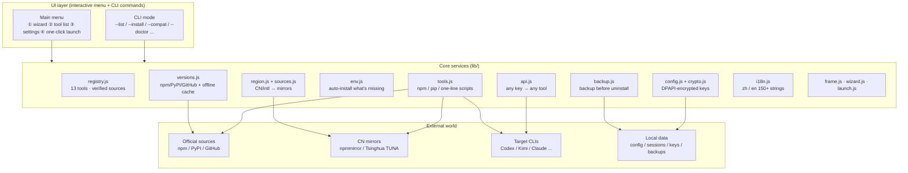

[简体中文](README.md) | **English**

<div align="center">


# 🪳 AI CLI Install Platform (ai-cli-hub)

**As resilient as a cockroach — survives anything, installs anywhere.**

An install platform that automatically pulls AI coding terminal tools from **verified official sources**:
one-click install, verify, uninstall (data backed up first), and **any API key seamlessly drives any tool**.

[](https://github.com/jincheng3870682453-hash/ai-cli-hub/releases)
[](https://github.com/jincheng3870682453-hash/ai-cli-hub/actions)
[](LICENSE)
[](https://github.com/jincheng3870682453-hash/ai-cli-hub)
[](package.json)
[](https://nodejs.org)

[Features](#-features) · [Architecture](#-architecture) · [Quick Start](#-quick-start) · [Usage](#-usage) · [Supported Tools](#-supported-tools-13) · [Uninstall](#-uninstall--backup-first-confirm-then-remove) · [Security](#-security) · [FAQ](#-faq) · [Contributing](#-contributing--community)

</div>

---

## ✨ Features

| | | |
|---|---|---|
| 🛡️ **Verified official sources** | Every package/repo in the registry is **manually cross-checked against official docs** — no squatted packages (`kimi-cli` ≠ `@moonshot-ai/kimi-code`) | Zero npm deps |
| 🔑 **Encrypted API keys** | Stored with Windows **DPAPI**, decryptable only on this machine | 9 providers |
| 🔌 **Universal compat layer** | **Any provider's key drives any tool** (OpenAI/Anthropic protocols auto-adapted — e.g. a DeepSeek key directly powers Codex) | 13/13 tools |
| 🧭 **3-step guided wizard** | Pick provider → enter key → pick model (54) → pick tool → auto-install + auto-configure | Zero learning curve |
| 🚀 **One-click launch** | Pick model → key → tool → **launch directly with your config** | Auto-returns on exit |
| 🌐 **Bilingual zh/en** | 150+ UI strings in both languages, `--lang` to switch | — |
| 🧪 **Self-healing env** | Detects Node/npm/git/python, auto-installs what's missing; downloads portable Node if absent | — |
| 🗺️ **Region-aware mirrors** | CN → npmmirror/Tsinghua TUNA; intl → official sources. Zero config | Fast & reliable |
| 🗑️ **Backup before uninstall** | Configs/sessions/credentials backed up first; aborts uninstall if backup fails | Data-safe |

## 🖥️ UI Preview

```text
🪳 AI CLI Install Platform v0.2.3 — Main menu

 1. Guided setup (API key → model → tool, auto-adapt)
 2. Download / fetch tools (tool list)
 3. Settings & overview (API keys / compat)
❯4. One-click launch (model → key → tool → start)
```

## 🏗️ Architecture



**One-liner**: the UI layer takes commands → core services pick the right source by region, fetch versions, install tools, configure keys and build the compat environment → the target CLI starts with your model and key; data is backed up before any uninstall.

## 🚀 Quick Start

**Prerequisites**: Windows + Node.js ≥ 18 (no Node? Double-click `启动安装平台.cmd` — it auto-downloads a portable Node).

```powershell
# 1. Clone (zero npm deps — runs directly, no npm install)
git clone https://github.com/jincheng3870682453-hash/ai-cli-hub.git
cd ai-cli-hub

# 2. Run
node index.js
```

On first run it auto-detects your **network region (CN/intl)** and switches to the right mirror source.

## 🧭 Usage

Main menu — four entries:

1. **Guided setup** (recommended for starters): pick **API key provider → enter key (encrypted) → pick model → pick tool → auto-install if missing → auto-generate compat config**
2. **Download / fetch tools**: tool list (`↑/↓` to select, `Enter` install, `u` uninstall, `i` details)
3. **Settings & overview**: interactive — switch language / change install dir / manage API keys
4. **One-click launch**: pick model → key → tool → launch the target CLI directly with your config

| Key | Action |
|---|---|
| `↑` / `↓` / `Enter` | select / confirm |
| `i` / `v` | details / verify |
| `u` | uninstall (backup first → `w` confirm / `n` cancel) |
| `q` / `Ctrl+Q` / `Ctrl+C` | quit / go back |

### CLI Mode (script / CI friendly)

```powershell
node index.js --list                      # tool list + install status (installed tools show local version, no network)
node index.js --urls                      # official URLs of all tools (avoid fake sites)
node index.js --wizard                    # enter the guided wizard directly
node index.js --launch                    # one-click launch
node index.js --api                       # API key management (list / add <id> <key> / remove <id>)
node index.js --compat codex --provider deepseek   # compat layer: DeepSeek key → Codex
node index.js --doctor                    # env & network diagnostics (auto-installs what's missing)
node index.js --region                    # show network region and mirrors in use
node index.js --install-dir "D:\tools"    # custom install dir
node index.js --lang zh                   # switch to Chinese
node index.js --version                   # version
```

## 🔑 API Key Management (9 providers)

```powershell
node index.js --api                     # list providers + key status
node index.js --api add deepseek sk-xxx # save (DPAPI-encrypted)
node index.js --api remove openai       # remove
```

Providers: `deepseek` · `moonshot` (Kimi) · `zhipu` (GLM) · `openai` · `anthropic` · `gemini` (Google) · `qwen` (Alibaba) · `siliconflow` · `openrouter` (aggregator).

Model catalog covers 54 models: DeepSeek V4 Pro/Flash, Kimi K2.x, GLM-5.x, GPT-5.x, Claude Opus 4.x, Gemini 2.5, Qwen3… (model names follow each platform's console).

> 🔐 Keys are stored **DPAPI-encrypted** (`%USERPROFILE%\.ai-cli-platform\api-keys.json`), decryptable only by the current user on this machine; if encryption fails you get an explicit warning and it falls back to plaintext.

## 🔌 Compat Layer: Any Key → Any Tool

```powershell
node index.js --compat codex --provider deepseek
# → generates codex-deepseek.env: OPENAI_API_KEY + OPENAI_BASE_URL
#   i.e. a DeepSeek key directly drives Codex / OpenCode / Aider / Continue / Qwen Code / Amp
```

All 13 tools have an adapter, chosen automatically from three strategies:

- **Env file** (`.env`): codex / opencode / aider / claude-code / continue / qwen-code / amp / gemini-cli / deepseek-cli
- **Config file** (written directly): deep-code (`~/.deepcode/settings.json`, original auto-backed up as `.bak`)
- **Built-in config UI** (command shown): kimi-code (`kimi /provider`) / aiconn / Zhipu helper

Anthropic-protocol tools (claude-code) automatically use the `/anthropic` compatible endpoint (provided by DeepSeek / Kimi / Zhipu). Incompatible combos never leave you stuck — you get the official docs plus alternatives (e.g. one OpenRouter key for all protocols).

## 🗑️ Uninstall = Backup First, Confirm, Then Remove

- Configs/sessions/credentials are backed up to `%USERPROFILE%\.ai-cli-platform\backups\` before uninstall
- If backup fails (file lock/permission) the uninstall **aborts** — your data is safe
- Interactive confirm is **w/n style**: `w` confirm, `n` cancel, any other key just reminds you once (anti-mistouch)

## Supported Tools (13)

| id | Tool | Official URL | Type |
|---|---|---|---|
| `deepseek-cli` | DeepSeek CLI (own project) | github.com/jincheng3870682453-hash/DeepSeek-CLI | one-line script |
| `kimi-code` | Kimi Code | kimi.com/code | npm -g |
| `claude-code` | Claude Code | claude.com/claude-code | npm -g |
| `codex` | Codex | github.com/openai/codex | npm -g |
| `opencode` | OpenCode | opencode.ai | npm -g |
| `gemini-cli` | Gemini CLI | github.com/google-gemini/gemini-cli | npm -g |
| `qwen-code` | Qwen Code | github.com/QwenLM/qwen-code | npm -g |
| `deep-code` | Deep Code (DeepSeek V4) | api-docs.deepseek.com/quick_start/agent_integrations/deepcode/ | npm -g |
| `amp` | Amp | ampcode.com | npm -g |
| `aider` | Aider | aider.chat | pip |
| `continue` | Continue CLI | github.com/continuedev/continue | npm -g |
| `aiconn` | AIConn | npmjs.com/package/aiconn | npm -g |
| `zhipu-helper` | Zhipu GLM helper | docs.bigmodel.cn/cn/coding-plan/extension/coding-tool-helper | npm -g |

> Full URL list anytime: `node index.js --urls`
> Note: the official DeepSeek Harness (dsh) engine is intentionally not listed — DeepSeek CLI already bundles it, and the official product is a web app, not a terminal tool.

## 🔧 Self-Healing Env + Region-Aware Mirrors

- `--doctor`: detects Node/npm/git/python/pip, auto-installs what's missing (git/python via winget)
- `--region`: auto-detects CN vs intl IP — CN uses npmmirror/Tsinghua TUNA, intl uses official sources
- Missing Node? `启动安装平台.cmd` auto-downloads a portable Node (falls back to the CN mirror if the official source fails)

## 🪳 Mascot: Xiaoqiang the Cockroach (original, trademark-safe)

The mascot is an original **chunky sideways-walking cockroach** (see `assets/logo.txt` ASCII / `assets/logo.svg` vector).
A cockroach is a generic animal — **not any company's mascot or logo**, no trademark risk.

## 🔐 Security

- Installs run `npm install -g ...` / `pip install ...` / official one-line scripts — identical to doing it manually
- API keys are **DPAPI-encrypted**, machine-bound; never commit `api-keys.json` to any repo
- Uninstall backups contain configs/credentials, stored locally only — delete them when done
- The registry is static JS (`registry.js`); **verify official sources before adding tools**

## ❓ FAQ

**Q: I don't have Node.js.**
Double-click `启动安装平台.cmd` — it auto-downloads a portable Node (CN mirror fallback included).

**Q: GitHub is unreachable from my network.**
The platform auto-detects your region and switches mirrors; tool installs go through npmmirror/TUNA — no manual config needed.

**Q: I don't have a key from that company — can I still use it?**
Yes. Any OpenAI-compatible key (DeepSeek/Kimi/Zhipu/SiliconFlow…) can drive Codex, OpenCode, etc.; Anthropic tools use the `/anthropic` compatible endpoint. Truly incompatible combos get official docs + alternatives.

**Q: Will my key be uploaded?**
No. Keys live only on your machine (DPAPI-encrypted); the platform never uploads any credential.

**Q: What's the difference between guided setup / one-click launch / manual config?**
- **Guided setup** (menu 1): configures key, model and tool in one pass, auto-generates compat config — best for first use
- **One-click launch** (menu 4): directly pick model + key + tool and launch — best for everyday use
- **Manual config** (`--compat` / `--api`): precise CLI control, for scripts and power users

**Q: Will uninstalling delete my data?**
No. Everything is backed up to `%USERPROFILE%\.ai-cli-platform\backups\` first; uninstall aborts if backup fails.

**Q: Will Chinese folder names cause problems?**
No. Backups, key storage and compat configs all live under `%USERPROFILE%\.ai-cli-platform\` (all-ASCII path) — the historical mojibake issue is fully avoided.

**Q: How do I uninstall the platform itself?**
Delete the `ai-cli-hub` folder; for a full cleanup also remove `%USERPROFILE%\.ai-cli-platform\` (backups, keys, compat configs).

**Q: Does it support macOS / Linux?**
Windows-first (DPAPI encryption, launcher and winget self-healing are Windows capabilities). It's pure Node stdlib, so basic functionality runs elsewhere, but encryption falls back to plaintext with a warning.

**Q: Why do some installed tools show no version?**
Version probing failed (e.g. restricted permissions or a sandbox) — shown as just "installed"; use `v` to verify manually. It doesn't affect usage.

**Q: Can I move my API key to another machine?**
No, not directly — DPAPI ciphertext is bound to "this machine + current user". Re-add the key on the new machine (intentional security design).

**Q: I get "Error: xxx" — what now?**
Paste the full error to [Issues](https://github.com/jincheng3870682453-hash/ai-cli-hub/issues), or report it in chat.

**Q: How do I add a new tool / model?**
Tool: add one entry in `registry.js` and verify the official source (3 steps in the Chinese README). Model: extend `PROVIDERS` in `lib/api.js`, or open a PR.

## 🧪 Testing & CI

- Unit test suite: `node test/run-tests.js` (42 checks, CI-safe — pure logic, no network, no keys)
  Covers i18n key completeness, registry/compat matrix, uninstall confirm, platform/arch mapping, compat layer, mirrors, backup module
- **GitHub Actions runs automatically**: every push/PR tests on **Windows + Linux × Node 18/20/22** (six combos, `.github/workflows/test.yml`); the badge shows live status
- To add tests: add a `check(...)` in `test/run-tests.js`

## 🤝 Contributing & Community

- Repo: [github.com/jincheng3870682453-hash/ai-cli-hub](https://github.com/jincheng3870682453-hash/ai-cli-hub) (Issues / PRs / Star ⭐)
- Author: [github.com/jincheng3870682453-hash](https://github.com/jincheng3870682453-hash)
- Sister project [DeepSeek CLI](https://github.com/jincheng3870682453-hash/DeepSeek-CLI) (a terminal agent built on DeepSeek Harness)

**Add a tool (3 steps)**: add one entry to the `TOOLS` array in `registry.js` (`kind: npm|pip|ps1-oneliner`, official `pkg`/`bin`/`dataDirs`) → `node index.js --refresh` to verify the version → `--info <id>` to confirm details.

## 📄 License

[MIT](LICENSE) © 2026 jincheng3870682453-hash

---

📖 Version history: [CHANGELOG.md](CHANGELOG.md)
