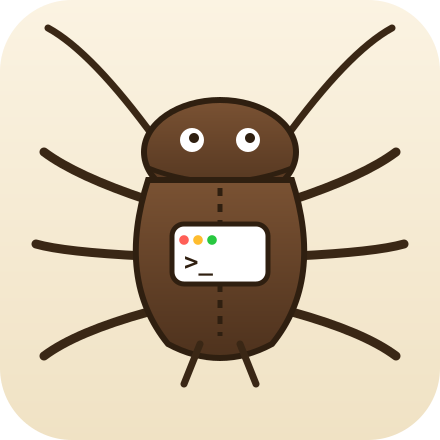
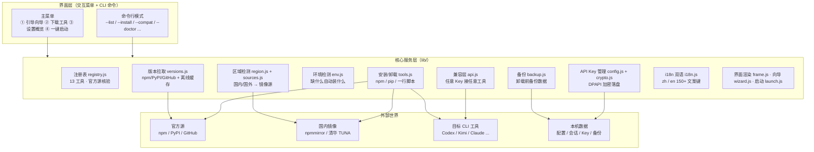

<div align="center">



# 🪳 AI CLI 安装平台（ai-cli-hub）

**像小强一样，打不死、到处都能装。**

一个自动从**官方源**拉取各家 AI 终端编程工具的安装平台：
一键安装、验证、卸载（先备份数据）、**任意 API Key 无缝接入任意工具**。

[](https://github.com/jincheng3870682453-hash/ai-cli-hub/releases)
[](https://github.com/jincheng3870682453-hash/ai-cli-hub/actions)
[](LICENSE)
[](https://github.com/jincheng3870682453-hash/ai-cli-hub)
[](package.json)
[](https://nodejs.org)

[功能特性](#-功能特性) · [架构](#-架构) · [快速开始](#-快速开始) · [使用指南](#-使用指南) · [支持的工具](#-支持的工具-13-个) · [卸载](#-卸载--先备份再确认才卸载) · [安全](#-安全说明) · [FAQ](#-faq) · [贡献](#-贡献与社区)

</div>

---

## ✨ 功能特性

| | | |
|---|---|---|
| 🛡️ **真伪校验** | 注册表所有包名/仓库**人工核对官方文档**，拒绝冒名包（`kimi-cli`≠`@moonshot-ai/kimi-code`） | 零依赖 |
| 🔑 **API Key 加密存储** | Windows **DPAPI** 加密落盘，仅本机可解 | 9 家提供商 |
| 🔌 **万能兼容层** | **任意公司的 Key 接任意工具**（OpenAI/Anthropic 协议自动适配，如 DeepSeek Key 直接驱动 Codex） | 13/13 工具全覆盖 |
| 🧭 **三步引导向导** | 选提供商 → 输 Key → 选模型（54 个）→ 选工具 → 自动装 + 自动配 | 零门槛 |
| 🚀 **一键启动** | 选模型 → 选 Key → 选工具 → **带着你的配置直接启动** | 退出自动返回 |
| 🌐 **中/英双语** | 全套界面 150+ 文案键 zh/en 全覆盖，`--lang` 一键切换 | 汉化友好 |
| 🧪 **环境自愈** | 检测 Node/npm/git/python，缺什么自动装什么；Node 缺失自动下载便携版 | — |
| 🗺️ **国内/国外源自动切换** | 国内→npmmirror/清华 TUNA，国外→官方源，全程零配置 | 快又稳 |
| 🗑️ **卸载先备份** | 卸载前自动备份配置/会话/凭证，失败则中止卸载 | 数据安全 |

## 🖥️ 界面预览

```text
🪳 AI CLI 安装平台 v0.2.3 — 主菜单

 1. 引导配置（API Key → 模型 → 工具，自动适配）
 2. 下载 / 拉取工具（工具列表）
 3. 已配置概览（API Key / 兼容配置）
❯4. 一键启动（选模型 → 选 Key → 选工具 → 启动）
```

## 🏗️ 架构



**核心流程一句话**：界面层收指令 → 核心层按区域选源、拉版本、装工具、配 Key、生成兼容环境 → 目标 CLI 带着你的模型和 Key 启动；卸载前先备份数据。

## 🚀 快速开始

**前置**：Windows + Node.js ≥ 18（没有 Node？双击 `启动安装平台.cmd` 会自动下载便携版）。

```powershell
# 1. 拉取本项目（零 npm 依赖，clone 后直接跑，无需 npm install）
git clone https://github.com/jincheng3870682453-hash/ai-cli-hub.git
cd ai-cli-hub

# 2. 运行
node index.js
```

首次运行会自动检测**网络区域（国内/国外）**并切换合适的镜像源。

## 🧭 使用指南

主菜单四个入口：

1. **引导配置**（推荐入门）：选 **API Key 提供商 → 输入 Key（加密保存）→ 选模型 → 选工具 → 未装自动下载 → 自动生成兼容配置**
2. **下载 / 拉取工具**：工具列表界面（`↑/↓` 选择，`Enter` 安装，`u` 卸载，`i` 详情）
3. **已配置概览**：交互式设置——切换语言 / 修改安装路径 / 管理 API Key
4. **一键启动**：选模型 → 选 Key → 选工具 → 直接带着配置启动目标 CLI

| 键 | 功能 |
|---|---|
| `↑` / `↓` / `Enter` | 选择 / 确认 |
| `i` / `v` | 查看详情 / 验证 |
| `u` | 卸载（先备份 → `w` 确认 / `n` 取消） |
| `q` / `Ctrl+Q` / `Ctrl+C` | 退出 / 返回上一级 |

### 命令行模式（脚本/CI 友好）

```powershell
node index.js --list                      # 工具清单 + 安装状态（已装工具显示本地版本，不联网）
node index.js --urls                      # 所有工具官方网址（防假站）
node index.js --wizard                    # 直接进入引导向导
node index.js --launch                    # 一键启动
node index.js --api                       # API Key 管理（list / add <id> <key> / remove <id>）
node index.js --compat codex --provider deepseek   # 兼容层：DeepSeek Key 接 Codex
node index.js --doctor                    # 环境与网络诊断（缺什么自动装什么）
node index.js --region                    # 查看网络区域与所用镜像源
node index.js --install-dir "D:\tools"    # 自定义安装路径
node index.js --lang en                   # 切换英文
node index.js --version                   # 版本
```

## 🔑 API Key 管理（9 家主流提供商）

```powershell
node index.js --api                     # 列出提供商 + key 状态
node index.js --api add deepseek sk-xxx # 保存（DPAPI 加密）
node index.js --api remove openai       # 删除
```

收录提供商：`deepseek`（深度求索）· `moonshot`（Kimi）· `zhipu`（智谱 GLM）· `openai` ·
`anthropic` · `gemini`（Google）· `qwen`（阿里通义）· `siliconflow`（硅基流动）· `openrouter`（聚合）。

模型目录覆盖 54 个模型：DeepSeek V4 Pro/Flash、Kimi K2.x、GLM-5.x、GPT-5.x、
Claude Opus 4.x、Gemini 2.5、Qwen3…（模型名以各平台控制台为准）。

> 🔐 Key 使用 **Windows DPAPI** 加密后落盘（`%USERPROFILE%\.ai-cli-platform\api-keys.json`），
> 密文仅本机当前用户可解；加密失败会明确警告并退化为明文。

## 🔌 兼容层：任意 Key 接任意工具

```powershell
node index.js --compat codex --provider deepseek
# → 生成 codex-deepseek.env：OPENAI_API_KEY + OPENAI_BASE_URL
#   即 DeepSeek 的 Key 直接驱动 Codex / OpenCode / Aider / Continue / Qwen Code / Amp
```

13 个工具全部有适配方案，三种方式自动选择：

- **环境变量文件**（`.env`）：codex / opencode / aider / claude-code / continue / qwen-code / amp / gemini-cli / deepseek-cli
- **配置文件**（直接写入）：deep-code（`~/.deepcode/settings.json`，原文件自动备份 `.bak`）
- **自带配置界面**（给出命令）：kimi-code（`kimi /provider`）/ aiconn / 智谱助手

Anthropic 协议（claude-code）自动走 `/anthropic` 兼容端点（DeepSeek / Kimi / 智谱均提供）。
不兼容组合给出官方文档 + 替代方案（如 OpenRouter 一个 Key 通吃所有协议），绝不让你卡住。

## 🗑️ 卸载 = 先备份，再确认，才卸载

- 卸载前自动把配置/会话/凭证备份到 `%USERPROFILE%\.ai-cli-platform\backups\`
- 备份失败（文件占用/权限）**中止卸载**，保护数据
- 交互确认 **w/n 制**：`w` 确认、`n` 取消、其他键只提醒一次（防误触）

## 支持的工具（13 个）

| id | 工具 | 官方网址 | 类型 |
|---|---|---|---|
| `deepseek-cli` | DeepSeek CLI（自研） | github.com/jincheng3870682453-hash/DeepSeek-CLI | 一行脚本 |
| `kimi-code` | Kimi Code | kimi.com/code | npm -g |
| `claude-code` | Claude Code | claude.com/claude-code | npm -g |
| `codex` | Codex | github.com/openai/codex | npm -g |
| `opencode` | OpenCode | opencode.ai | npm -g |
| `gemini-cli` | Gemini CLI | github.com/google-gemini/gemini-cli | npm -g |
| `qwen-code` | Qwen Code | github.com/QwenLM/qwen-code | npm -g |
| `deep-code` | Deep Code（DeepSeek V4） | api-docs.deepseek.com/quick_start/agent_integrations/deepcode/ | npm -g |
| `amp` | Amp | ampcode.com | npm -g |
| `aider` | Aider | aider.chat | pip |
| `continue` | Continue CLI | github.com/continuedev/continue | npm -g |
| `aiconn` | AIConn | npmjs.com/package/aiconn | npm -g |
| `zhipu-helper` | 智谱 GLM 助手 | docs.bigmodel.cn/cn/coding-plan/extension/coding-tool-helper | npm -g |

> 完整网址随时可查：`node index.js --urls`
> 注：DeepSeek Harness (dsh) 官方引擎不单列——DeepSeek-CLI 已内置，且官方是 Web 版而非终端工具。

## 🔧 环境自动检测 + 区域源切换

- `--doctor`：检测 Node/npm/git/python/pip，缺什么自动装什么（git/python 走 winget）
- `--region`：自动识别国内/国外 IP——国内自动用 npmmirror/清华 TUNA，国外用官方源
- Node 缺失时 `启动安装平台.cmd` 自动下载便携版（官方源失败自动切国内镜像）

## 🪳 吉祥物：小强（原创，无商标风险）

平台吉祥物是**横着爬的胖小强**（蟑螂，见 `assets/logo.txt` ASCII 版 / `assets/logo.svg` 矢量版）。
蟑螂是通用动物形象，**不是任何公司/产品的吉祥物或标志**，无商标风险，可放心使用。

## 🔐 安全说明

- 安装执行 `npm install -g ...` / `pip install ...` / 官方一行脚本——与手动安装完全一致
- API Key 以 **DPAPI 加密**保存，仅本机可解；请勿把 `api-keys.json` 提交到任何仓库
- 卸载备份含配置/凭证，仅保存在本机，用完可删
- 注册表是静态 JS（`registry.js`），新增工具前**先核对官方来源**

## ❓ FAQ

**Q：没有 Node.js 怎么办？**
双击 `启动安装平台.cmd`，会自动下载便携版 Node（国内自动走 npmmirror 镜像）。

**Q：国内网络拉不动 GitHub？**
平台自动检测区域并切换镜像；工具安装走 npmmirror/TUNA，无需手动配置。

**Q：我没有某家公司的 Key，能用吗？**
可以。用任一 OpenAI 兼容 Key（DeepSeek/Kimi/智谱/硅基流动…）即可接入 Codex、OpenCode 等；
Anthropic 系工具走 `/anthropic` 兼容端点。真不兼容的组合会给官方文档 + 替代方案。

**Q：Key 会被上传吗？**
不会。Key 只存在你本机（DPAPI 加密），平台不联网上传任何凭证。

**Q：引导向导 / 一键启动 / 手动配置有什么区别？**
- **引导向导**（主菜单 1）：把 Key、模型、工具一次配好，自动生成兼容配置——适合第一次用
- **一键启动**（主菜单 4）：直接选模型 + Key + 工具，带着配置启动——适合日常快速开用
- **手动配置**（`--compat` / `--api`）：命令行精确控制，适合脚本和高级用户

**Q：卸载工具会删掉我的数据吗？**
不会。卸载前自动把配置/会话/凭证备份到 `%USERPROFILE%\.ai-cli-platform\backups\`，备份失败会中止卸载。

**Q：我的中文目录名会不会出问题？**
不会。备份目录、Key 存储、兼容配置全部放在 `%USERPROFILE%\.ai-cli-platform\`（全 ASCII 路径），
历史上出现过的中文路径乱码问题已彻底规避。

**Q：如何卸载平台本身？**
删除 `ai-cli-hub` 文件夹即可；如需彻底清理，再删除 `%USERPROFILE%\.ai-cli-platform\`
（含备份、Key、兼容配置）。

**Q：支持 macOS / Linux 吗？**
当前以 Windows 为主（DPAPI 加密、启动器、winget 自愈均为 Windows 能力）；
Node 标准库实现，非 Windows 可跑基本功能，但加密会退化为明文并警告。

**Q：为什么有些已装工具不显示版本号？**
版本读取失败时只显示"已装"（如权限受限或沙箱环境），不影响使用，可手动 `v` 验证。

**Q：API Key 换电脑能用吗？**
不能直接搬——DPAPI 密文绑定"本机 + 当前用户"，换机器需重新添加 Key（这是刻意的安全设计）。

**Q：报错"发生错误: xxx"怎么办？**
把完整报错贴到 [Issues](https://github.com/jincheng3870682453-hash/ai-cli-hub/issues)，或直接在对话里告诉我。

**Q：想收录新工具 / 新模型？**
工具：在 `registry.js` 加一条并核对官方源（README「新增工具」有 3 步）；
模型：在 `lib/api.js` 的 `PROVIDERS` 里补充，或提 PR 由作者更新。

## 🤝 贡献与社区

- 本仓库：[github.com/jincheng3870682453-hash/ai-cli-hub](https://github.com/jincheng3870682453-hash/ai-cli-hub)（提 Issue / PR / Star ⭐）
- 作者：[github.com/jincheng3870682453-hash](https://github.com/jincheng3870682453-hash)
- 姊妹项目 [DeepSeek CLI](https://github.com/jincheng3870682453-hash/DeepSeek-CLI)（基于 DeepSeek Harness 的终端 Agent）

**新增工具（3 步）**：在 `registry.js` 的 `TOOLS` 数组加一条（`kind: npm|pip|ps1-oneliner`，填官方 `pkg`/`bin`/`dataDirs`）→ `node index.js --refresh` 验证版本 → `--info <id>` 确认详情。

## 📄 License

[MIT](LICENSE) © 2026 jincheng3870682453-hash

---

📖 版本历史见 [CHANGELOG.md](CHANGELOG.md)
